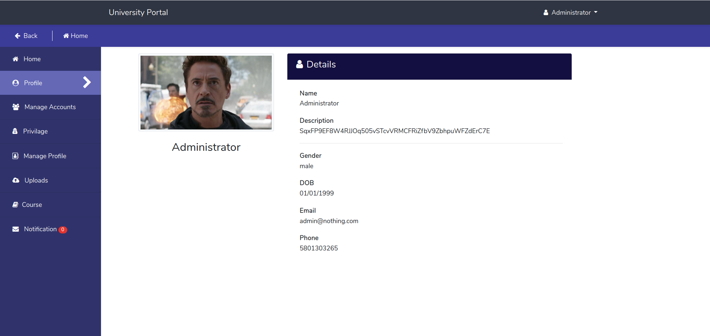
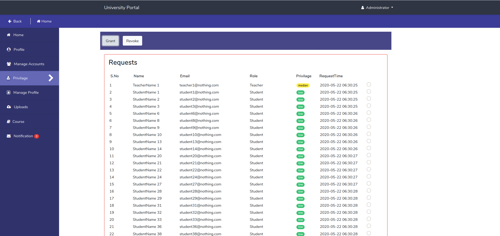
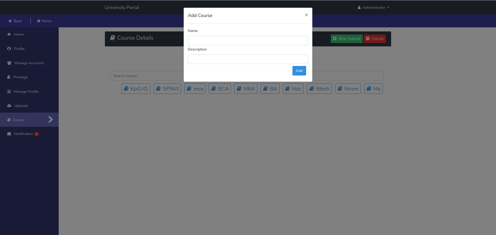
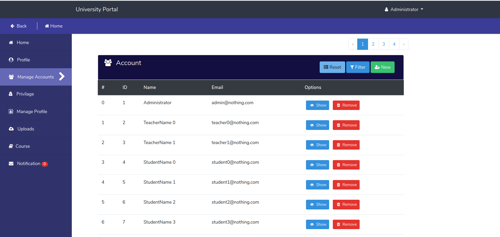
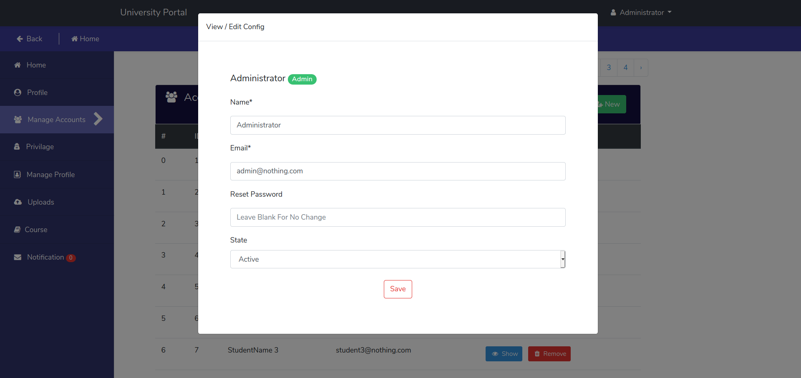
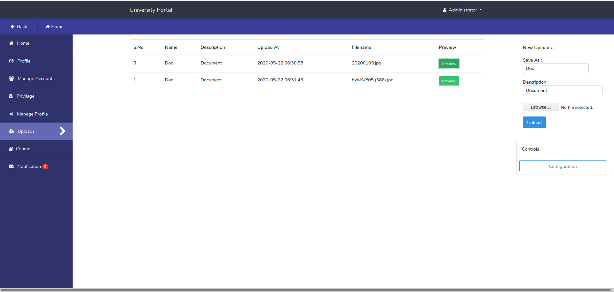
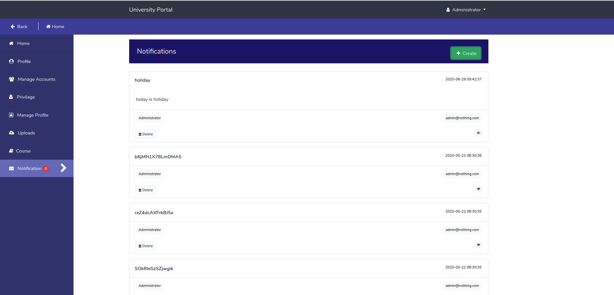

# University Portal
A Laravel Based Web Application Platform For Universities, Colleges and Educational Institutes.

### Project Detail
It is a laravel based web application prototype that provide a systematic, reliable and
communication mediam between students, teachers and other college members.
This application can easily handle large University level heavy load workload after little bit more customization and modifications.
It provides facilities In which teachers can easily provide Assignments, Notes, Syllabus to students and Students can easily get the details of Syllabus,Assignments,Time Table. 
College Faculty can also provide any notice to all the students of college at once and many more features. 

### Project Development 
This Project is Currently Under  Phase. This Project is Waiting for . Please Contact Project Admin for Details

### Key Features
	- Communication Between Teacher, Student and Admin
	- Parties Can Share Docs, Info and Files Easily
	- Easy transfer of information.
	- Teachers can Provide Assignments,Notes.
	- Students can submit Assignments.
	- Many More

### Application Preview

**HomePage**

---

**Profile Panel**

---

**Profile Page**

---

**Privilage Panel**

---

**Course Panel**

---

**Add New Course**

---

**Account Management Panel**

---

**Manage User**

---

**Uploads Panel**

---

**Notification Panel**

### Developers/Author
- Suraj Singh Bisht [Email](mailto:surajsinghbisht054@gmail.com?subject=[Github_University_Portal]) [Github](https://github.com/surajsinghbisht054) 
- Himanshu Sharma [Email](mailto:himanshusharma2972@gmail.com) [Github](https://github.com/himanshuthecoder)

### License

This project is licensed under the Apache License - see the [LICENSE](LICENSE) file for details

