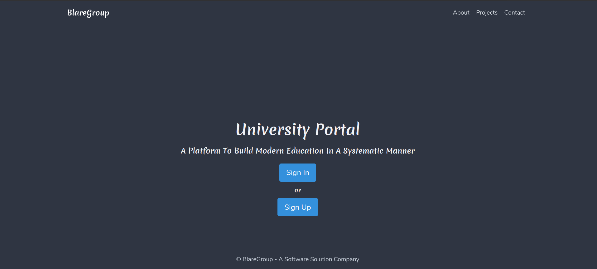
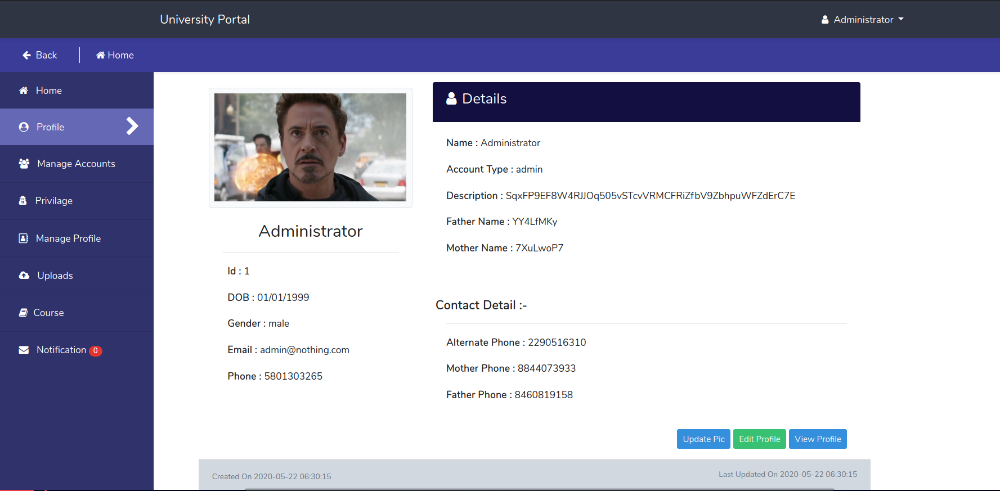
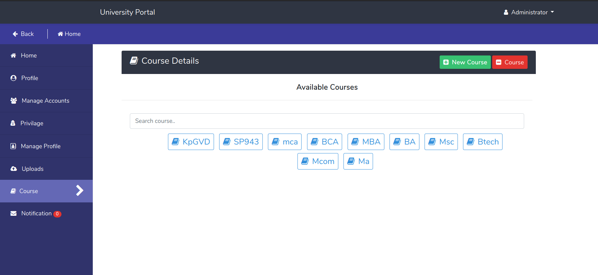

# UniversityPortal
A Web Application Platform For Colleges.

### About
It is a Web Application for making communication between students and colleges to the next level. It is a complete package where Teachers can easily provide Assignments,Notes,Syllabus to students and Students can easily get the details of Syllabus,Assignments and they can check time table. College Faculty can also provide any notice to all the students of college at once. 

### Key Features
	- Students can ask queries to teachers.
	- Easy transfer of information.
	- Teachers can Provide Assignments,Notes.
	- Students can submit Assignments.

### Application Preview
---

---
---

---
---

---

### Developers/Author
- Suraj Singh Bisht [Email](surajsinghbisht054@gmail.com) [Github](https://github.com/surajsinghbisht054)
- Himanshu Sharma [Email](himanshusharma2972@gmail.com) [Github](https://github.com/himanshuthecoder)
- Arvind Sharma [Email](slowestwind@gmail.com) [Github](https://github.com/slowestwind)
### License

This project is licensed under the Apache License - see the [LICENSE](LICENSE) file for details

